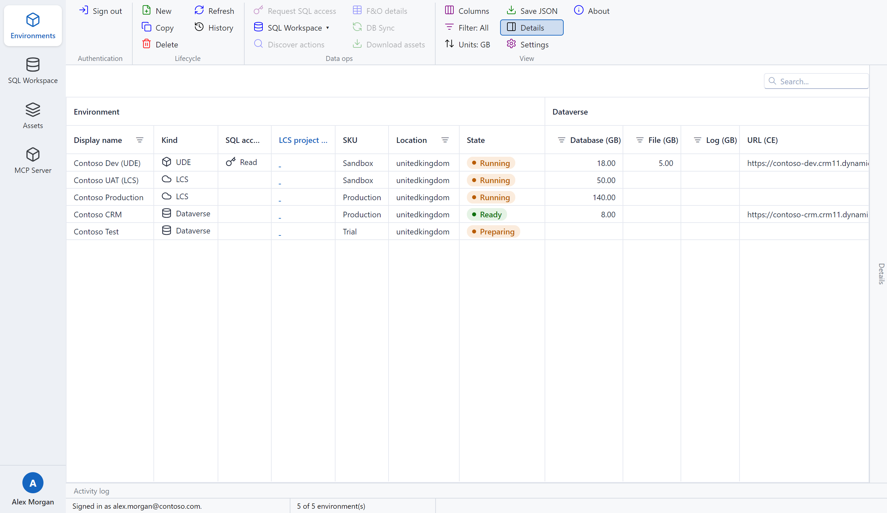
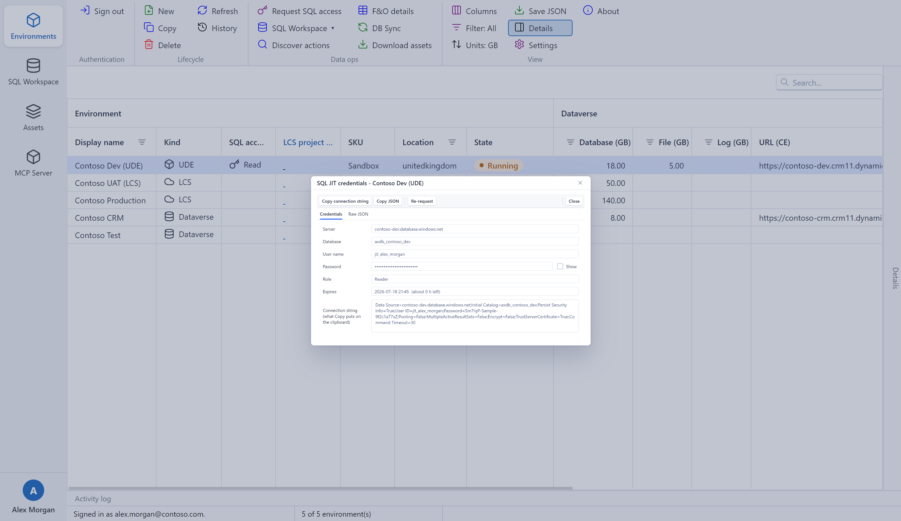
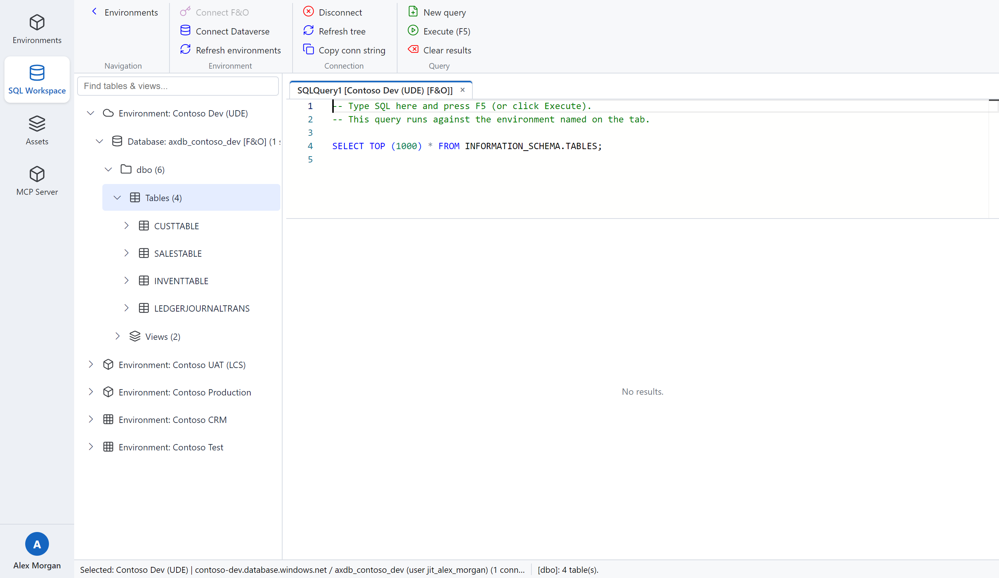
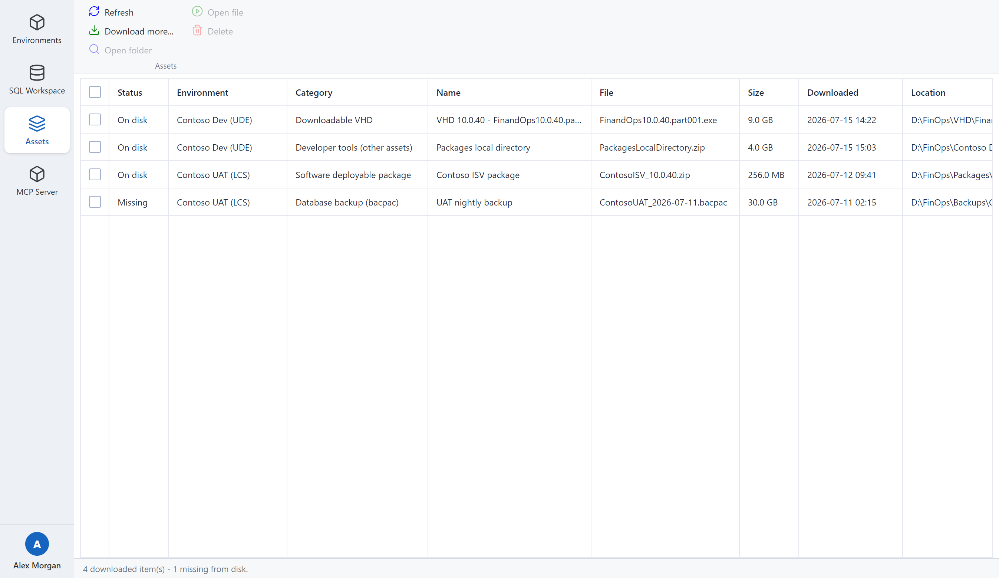
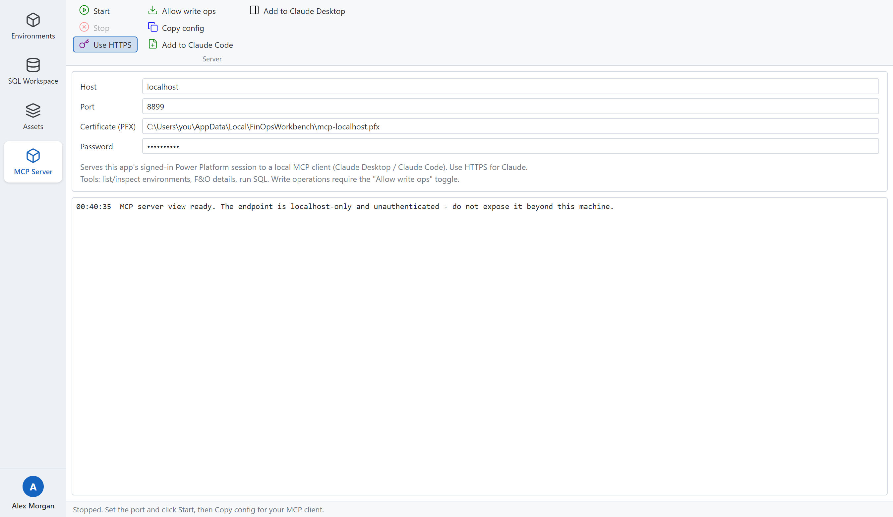
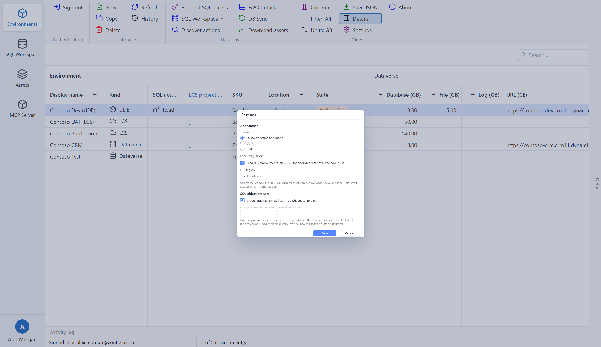
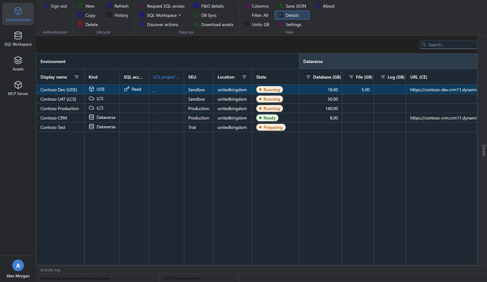

# FinOps Workbench — User Guide

FinOps Workbench is a Windows desktop app for managing Microsoft **Power
Platform** and **Dynamics 365 Finance & Operations (F&O)** environments from one
place: list and provision environments, request just-in-time SQL access, query
environment databases, download Lifecycle Services (LCS) assets, follow
lifecycle operations, and expose an MCP server for AI tooling.

This guide walks through everything the app does. Screens shown use sample data.

- [What it does](#what-it-does)
- [System requirements](#system-requirements)
- [Installing the app](#installing-the-app)
- [Getting started](#getting-started)
- [The Environments view](#the-environments-view)
- [Lifecycle operations](#lifecycle-operations)
- [Requesting just-in-time SQL access](#requesting-just-in-time-sql-access)
- [The SQL workspace](#the-sql-workspace)
- [Downloading assets](#downloading-assets)
- [The MCP server](#the-mcp-server)
- [Settings & appearance](#settings--appearance)
- [Keyboard shortcuts](#keyboard-shortcuts)
- [Where your data lives](#where-your-data-lives)
- [Troubleshooting](#troubleshooting)
- [FAQ](#faq)
- [About & support](#about--support)

---

## What it does

FinOps Workbench talks to the Power Platform admin APIs and, optionally,
Lifecycle Services on your behalf. It recognises three **kinds** of environment,
and most actions are enabled or disabled depending on which kind you've selected:

| Kind | Icon | What it is |
|---|---|---|
| **UDE** | cube | A **unified developer environment** — an F&O environment with a linked Dataverse org that supports the modern admin APIs (SQL JIT, DB Sync, dev-tools downloads). |
| **LCS** | cloud | An **LCS-managed** F&O environment. Managed through Lifecycle Services rather than the Power Platform admin API; some actions redirect you to the LCS portal. |
| **Dataverse** | database (cylinder) | A plain **Dataverse** environment with no F&O database. |

Everything runs against **your own signed-in identity** — there is no service
account, tenant id, client id or secret to configure. You must be an
administrator on the environments you want to manage.

---

## System requirements

- **Windows 10 or Windows 11** (x64, ARM64, or 32-bit / ia32).
- A **Microsoft Entra ID** (work/school) account with administrator rights on the
  Power Platform / F&O environments you intend to manage.
- **Internet access** to Microsoft endpoints (`login.microsoftonline.com`,
  the Power Platform admin APIs, your Dataverse org URLs, and — for LCS
  features — `lcs.dynamics.com` / `lcsapi.lcs.dynamics.com`).
- No SQL client or ODBC driver needs to be installed — the SQL workspace and the
  MCP SQL tools use a built-in TDS client.

The installer is **not code-signed**, so Windows SmartScreen may warn on first
launch (see [Installing the app](#installing-the-app)).

---

## Installing the app

1. Download the latest installer from the
   [Releases page](https://github.com/veriland/FOWorkbench-releases/releases/latest).
   Pick the installer for your machine:

   | Installer | For |
   |---|---|
   | `FinOpsWorkbench-<version>-x64-setup.exe` | 64-bit Windows (most PCs) |
   | `FinOpsWorkbench-<version>-arm64-setup.exe` | Windows on ARM |
   | `FinOpsWorkbench-<version>-ia32-setup.exe` | 32-bit Windows |
   | `FinOpsWorkbench-<version>-setup.exe` | Combined (auto-selects your architecture) |

2. Run the installer. Because it isn't code-signed, SmartScreen may show
   *"Windows protected your PC"*. Click **More info → Run anyway** to continue.
   The installer lets you choose the install location and does not require
   administrator rights (it installs per-user by default).

3. Launch **FinOps Workbench** from the Start menu.

**Updates** — new versions are published to the same Releases page. Download and
run the newer installer over your existing install; your settings and cached
session are preserved.

---

## Getting started

1. On the **Environments** page, click **Sign in** (Authentication group of the
   ribbon). A Microsoft sign-in window opens inside the app — sign in with your
   Entra ID account and complete any multi-factor prompts.
2. Once signed in, your name and account appear in the bottom-left corner and the
   environment list loads automatically.
3. The status bar (bottom) shows **Signed in as `<your UPN>`** and a count of
   visible / total environments.

Behind the scenes the app also tries to set up two extra sessions from the same
sign-in, silently where it can:

- a **developer-tools** session (used later when you download assets), and
- an **LCS** session (so LCS SQL access and LCS asset downloads don't need a
  separate sign-in).

If either can't be captured silently, the app just sets it up the first time you
need it — you'll see a note in the [Activity log](#details-and-activity-log).

Your session is remembered **securely** between launches (encrypted with
Windows DPAPI), so you normally only sign in once. On startup the app restores
your previous session; if it has expired you'll be prompted to sign in again.
**Sign out** (same button when signed in) clears all tokens, the LCS session,
browser cookies and cached SQL grants.

---

## The Environments view

The home page lists every environment you can administer, with live status,
capacity, versions and lifecycle state.

### Layout

- **Left rail** — switch between the four areas (Environments, SQL Workspace,
  Assets, MCP Server). Your signed-in account sits at the bottom; the rail
  collapses to icons via the hamburger button.
- **Ribbon** — grouped actions (**Authentication**, **Lifecycle**, **Data ops**,
  **View**). Buttons enable or disable based on the selected environment's kind
  and state.
- **Grid** — one row per environment, organised into **Environment**,
  **Dataverse** and **F&O** column bands.
- **Details** tab (right edge) and **Activity log** (bottom edge) — both tuck
  away by default; click the tab to expand.

### The grid

- The **Kind** column shows whether a row is a **UDE**, **LCS**, or **Dataverse**
  environment (see [What it does](#what-it-does)).
- Coloured **State**, **Operation status** and **F&O state** pills give status at
  a glance — green = healthy/ready, amber = busy (provisioning, copying,
  syncing…), red = failed/unavailable, blue = admin/maintenance, grey = neutral.
- The **SQL access** column shows a key icon when a valid SQL JIT grant is
  currently held for that row (**Read** or **Read-write**). The key disappears
  automatically when the grant expires.
- **Double-click** any row to open its full JSON (a curated **Details** tab plus
  the **Raw JSON**).
- **Type to search**, drag column headers to reorder, and click a column's filter
  button to filter. Sorting is case-insensitive, Explorer-style.

**Column presets & units** (View group):

- **Columns** — apply the **F&O** preset (default), the **Dataverse** preset, or
  **Show all columns**, or toggle individual columns.
- **Units: GB / MB** — switch the storage capacity columns between GB and MB.
- **Filter: All** — show all environments, **UDE / F&O only**, or **Dataverse
  only**.

### Details and Activity log

- **Details** (right edge) shows a full, curated breakdown of the selected
  environment — general info, status, capacity, Dataverse and F&O metadata,
  links and more.
- **Activity log** (bottom edge) records everything the app does, colour-coded by
  severity (info / success / warning / error) with timestamps. Right-click to
  **Copy row** or **Copy all messages** (tab-separated, pastes cleanly into a
  spreadsheet). When something doesn't work as expected, this is the first place
  to look.

---

## Lifecycle operations

These live in the **Lifecycle** and **Data ops** ribbon groups. Actions that
change or provision environments always confirm first, and most are submitted
asynchronously — click **Refresh** to track progress in the **Operation status**
pill.

| Action | Kind | What it does |
|---|---|---|
| **New environment** | any | Provision a new environment. Choose a display name, SKU (Sandbox / Production / Trial), Azure region, template, and whether to enable dev tools, demo data and a database. |
| **Copy** | UDE / F&O | Overwrite a target environment with a copy of the selected one (full or minimal; optionally transactionless; optionally including audit data). Type-to-confirm; **this replaces the target and cannot be undone.** |
| **Delete** | UDE / Dataverse | Permanently delete an environment. You must type the environment's display name exactly to confirm. |
| **Refresh** | — | Reload the list and fetch F&O details, LCS enrichment, and (if enabled) LCS-only environments in the background. |
| **History** | UDE / Dataverse | Show the lifecycle-operation history (copies, restores, DB syncs…), with a per-operation stage breakdown and a pinned find box. |
| **DB Sync** | UDE | Trigger a full database synchronisation and follow it live in the **Operation status** pill. The F&O runtime restarts as part of completing. |
| **Save JSON** | — | Save the selected environment's raw definition to a `.json` file. |
| **Discover actions** | UDE / Dataverse | Probe the Dataverse `$metadata` for available actions and show them in a text viewer. |
| **F&O details** | UDE | Read the F&O application/platform version, deployment type and state. |

**LCS-managed environments** don't support Copy, Delete, History or DB Sync
through the app — the Power Platform admin APIs don't manage them. When you try,
the app tells you to use the **LCS portal** instead (for example, JIT database
access is granted from the environment's *Maintain* menu in LCS).

---

## Requesting just-in-time SQL access

Select an environment and click **Request SQL access** (enabled for UDE and LCS
environments). Choose a **reason** and an **access level**:

- Pick a **standard reason** and the app sets the **role** automatically
  (Reader or Writer) — you can still change it, or type your own reason.
- The app finds your public IP (or you can enter it), opens the SQL firewall for
  that IP, and requests time-limited credentials.
- For **UDE** environments this goes through the supported Dataverse action.
  For **LCS** environments it signs you in to Lifecycle Services once (if needed)
  and completes the request there.

Credentials are valid for **about 12 hours** and only from the allowed IP. You
must be a system administrator on the environment.

The result is the **SQL JIT credentials** viewer:

- **Credentials tab** — the server, database, user name, password (masked, with a
  **Show** toggle), role and expiry (with the time remaining), plus a ready-to-use
  **connection string**.
- **Copy connection string** puts the .NET/SSMS-ready connection string on the
  clipboard; **Copy JSON** copies the raw response; **Raw JSON** shows the full
  response on its own tab.
- **Re-request** obtains a fresh grant — for example to upgrade a read grant to
  read/write.

The granted credentials are cached for the session (the environment's **SQL
access** column shows a key), so the **SQL Workspace ▾ → Finance & Operations
database** option opens straight away without asking again. Re-opening **Request
SQL access** while a grant is still valid for your current IP just shows the held
credentials; if your public IP has changed, the app requests fresh access
automatically.

---

## The SQL workspace

An SSMS-style workspace for browsing and querying environment databases.

- **Object browser** (left) — lists **all** your environments, each with its kind
  icon. Select one and connect it (see below); connected environments expand to
  their database → schemas → **Tables** / **Views** → columns. Very large F&O
  schemas group objects into alphabetical folders so nothing has to load tens of
  thousands of names at once. Type in the filter box to find objects quickly.
  Both the **F&O** and **Dataverse** endpoints of the same environment can be
  connected at once, merged under one environment node.
- **Query tabs** (right) — each tab has a SQL editor and a results grid, and runs
  against the environment named on the tab. Press **F5** (or **Execute**) to run;
  **Ctrl+Space** opens auto-complete (T-SQL keywords plus the environment's
  tables and columns).
- **Double-click a table** to open a new tab pre-filled with
  `SELECT TOP (1000) * FROM [schema].[table]` and run it automatically.

**Connecting** — select an environment in the object browser and use the ribbon
(or right-click the environment → **Connect**):

- **Connect F&O** — connects the finance & operations database using a SQL JIT
  grant. For a **UDE** environment it requests the grant for you (Reader or
  Read-write); for an **LCS** environment it reuses a held grant or runs the LCS
  request via the Environments view. Reader or Read-write follows your grant.
- **Connect Dataverse** — connects the org's read-only TDS endpoint using your
  signed-in identity, **no separate credentials needed**. Writes are rejected by
  the server.

You can also open the workspace straight from the Environments page via
**SQL Workspace ▾** (**Finance & Operations database** / **Dataverse tables**),
which switches here and connects the selected environment in one step.

**First connect can take a minute.** When you connect F&O on a just-granted JIT
credential, Microsoft may still be provisioning the SQL login and firewall rule —
the workspace shows a *"Waiting for Microsoft to provision JIT SQL access…"*
overlay and retries automatically for up to four minutes.

Ribbon actions: **Connect F&O** / **Connect Dataverse** / **Refresh environments**
(re-fetch the environment list), **Disconnect**, **Refresh tree** (reload
tables/views), **Copy conn string**, **New query**, **Execute (F5)**,
**Clear results**, and **Environments** (back to the home view). There is no
client-imposed row limit — the only limit is whatever `TOP` your SQL contains.

---

## Downloading assets

Select an environment and click **Download assets** to open the picker (enabled
for UDE and LCS environments). It lists everything available for that
environment:

- **Downloadable VHD** versions and **developer tools** (Packages local
  directory, the F&O Visual Studio extension, Trace Parser, cross-reference
  database) — for any environment with a Dataverse org.
- For **LCS-managed** environments, also the project's **asset library**
  (software deployable packages, data packages, models, GER configurations, NuGet
  packages) and **database backups (bacpacs)**.

Tick what you want and click **Download…** to save to a folder. Downloads run in
the background with per-item progress; you can minimise the window (progress
stays visible in the system tray) and start several batches at once. Multi-part
VHDs download all parts into the chosen folder.

The **Assets** page is your download library — it shows what you've already
downloaded, whether each file is still on disk, and quick actions to **Open
file**, **Open folder**, **Download more…** or **Delete** (sends the file to the
Recycle Bin and removes it from the list).

---

## The MCP server

FinOps Workbench can expose your signed-in session to AI tooling (Claude Desktop
or Claude Code) through a built-in **Model Context Protocol** server. An assistant
can then list and inspect environments, read F&O details and operation status,
and run SQL on your behalf.

1. Set the **Host** / **Port** (defaults `localhost` / `8899` are fine for local
   use).
2. Leave **Use HTTPS** on — most MCP clients, including Claude, require HTTPS.
   The app ships a self-signed localhost certificate; the fields below let you
   point at your own PFX if you prefer.
3. Click **Start**. The log shows *"MCP server listening on
   https://localhost:8899"*.
4. Register the server with your client:
   - **Add to Claude Code** — runs `claude mcp add` for you (user scope). In
     Claude Code, run `/mcp` to confirm.
   - **Add to Claude Desktop** — writes the connection into Claude Desktop's
     config via the `mcp-remote` bridge. Fully quit and reopen Claude Desktop
     afterwards.
   - **Copy config** — copies the connection snippet to paste into any client
     manually.

**Tools exposed:** `auth_status`, `sign_in`, `list_environments`,
`get_environment_details`, `get_environment_history`, `get_finops_details`,
`get_operation_status`, `run_sql`, and `request_sql_jit` (guidance only). SQL
runs against a held JIT grant for F&O/UDE environments, or the read-only
Dataverse TDS endpoint for plain Dataverse orgs.

**Write operations** (`create_environment`, `copy_environment`,
`delete_environment`, `dbsync_to_finops`) are **off by default**. Turn on
**Allow write ops** only if you want the assistant to make changes; the toggle
takes effect immediately, even while the server is running.

> **Security:** the endpoint is localhost-only and **unauthenticated** — it
> exposes your own signed-in session to any local MCP client. Don't expose it
> beyond your machine, and leave write ops off unless you need them.

---

## Settings & appearance

Open **Settings** from the ribbon (View group).

- **Theme** — **Follow Windows app mode** (default), or pin **Light** / **Dark**.
  The whole app re-themes instantly, and (on Follow Windows) tracks your OS
  light/dark switch live.
- **Load LCS environments** — also crawl Lifecycle Services for F&O environments
  that aren't in the Power Platform admin list. Turn off if you only work with
  Power Platform environments.
- **LCS region** — pick the regional LCS REST API endpoint used for asset
  downloads (leave on **Global** unless your LCS tenant is in a specific geo).
- **SQL object browser** — **Group large table/view lists into alphabetical
  folders** (and the object-count threshold at which grouping kicks in). This
  keeps the SQL workspace tree responsive on huge schemas — an F&O database has
  ~25,000 tables. Turn it off to always list every object directly (slower to
  expand on large databases).

Settings are saved to `%LOCALAPPDATA%\FinOpsWorkbench\settings.json`. After
changing LCS options, click **Refresh** to pick up the changes.

The app follows your Windows light/dark preference automatically:

---

## Keyboard shortcuts

| Shortcut | Where | Action |
|---|---|---|
| **F5** | SQL editor | Run the active query tab |
| **Ctrl+Space** | SQL editor | Open auto-complete |
| **Tab** | SQL editor | Indent (does not change focus) |
| **Type to search** | Environments grid / object tree | Incremental find |
| **Double-click** | Environments row | Open the environment JSON viewer |
| **Double-click** | SQL object tree table/view | Open & run `SELECT TOP (1000)` |
| **Ctrl / Shift + click** | Environments grid | Multi-select rows |

---

## Where your data lives

FinOps Workbench stores everything under your Windows profile — nothing is sent
anywhere except the Microsoft services you're administering.

| Data | Location |
|---|---|
| Settings (theme, LCS options) | `%LOCALAPPDATA%\FinOpsWorkbench\settings.json` |
| Download history (Assets page) | `%LOCALAPPDATA%\FinOpsWorkbench\downloads.json` |
| Tokens, LCS session, cached SQL grants | Encrypted store (Windows DPAPI) |
| Sign-in browser profiles | `%LOCALAPPDATA%\FinOpsWorkbench\WebView2\` |

**Secrets are never logged.** Tokens, passwords, cookies, connection strings and
download SAS URLs are kept out of the Activity log and diagnostics.

---

## Troubleshooting

**SmartScreen warns when I run the installer.**
The installer isn't code-signed. Click **More info → Run anyway**. This is
expected and safe for a release from the official Releases page.

**Sign-in window is blank or won't load.**
The app uses an embedded Microsoft Edge WebView2 browser. If it can't start
(common on some virtual machines), the app falls back to opening your default
browser to finish sign-in — watch the Activity log for that note. Ensure the
machine can reach `login.microsoftonline.com`.

**"Request SQL access" is disabled.**
It's only available for **UDE** and **LCS** environments, and (for UDE) the
environment must expose a Dataverse org. Plain Dataverse environments have no
F&O database to grant access to — query them via **SQL Workspace ▾ → Dataverse
tables** instead.

**The SQL workspace sits on "Waiting for Microsoft to provision JIT SQL
access…".**
Microsoft provisions the SQL login and firewall rule on demand; this can take up
to a minute or two on a fresh grant. The app retries for up to four minutes.
If it still fails, check the error dialog — it shows the (secret-masked)
connection parameters it tried. A changed public IP is a common cause; re-request
access to refresh the firewall rule.

**LCS features ask me to sign in again / an "unsupported browser" appears.**
LCS uses a separate sign-in session captured in its own browser profile. Complete
the LCS sign-in window when prompted and click **Use this session**. If Load LCS
environments is on but you don't use LCS, you can turn it off in Settings.

**Claude can't connect to the MCP server.**
Make sure the server is **Started**, **Use HTTPS** is on (Claude requires it),
and you've registered it with **Add to Claude Code / Desktop**. For Claude
Desktop, fully quit (system-tray → Quit) and reopen it after adding. Then ask the
assistant to call `auth_status`.

**"Add to Claude Code" says the CLI wasn't found.**
Install Claude Code and make sure `claude` is on your PATH, then try again — or
run the printed `claude mcp add …` command manually.

**The app window shows a DevExtreme trial watermark.**
That's a build produced without the UI-component license key. Use an official
installer from the Releases page.

---

## FAQ

**Do I need to configure a tenant, client id or secret?**
No. The app signs you in interactively with your own account and uses your
identity for everything.

**Is my session shared with anyone?**
No. Tokens are stored encrypted on your machine and used only to call Microsoft
services. The MCP server, if you start it, is localhost-only.

**Can I manage LCS environments fully from the app?**
Partly. You can list them, enrich their details, request SQL access, and download
LCS assets. Copy, Delete, History and DB Sync for LCS environments must be done
in the LCS portal.

**Does querying Dataverse cost or change anything?**
The Dataverse SQL endpoint is **read-only** — only `SELECT` works, and it needs
no separate credentials beyond your sign-in.

**Is the app free?**
Yes. FinOps Workbench is built and maintained by Veriland Consulting for the
Dynamics 365 community — free to use and share, provided "as is" without
warranties.

---

## About & support

FinOps Workbench is built and maintained by **Veriland Consulting** —
Dynamics 365 & Azure consulting for UK mid-market businesses.

- Website: [veriland.co.uk](https://www.veriland.co.uk)
- Downloads & releases:
  [FOWorkbench-releases](https://github.com/veriland/FOWorkbench-releases/releases/latest)

Open **About** from the ribbon to see the installed version and OS details.
